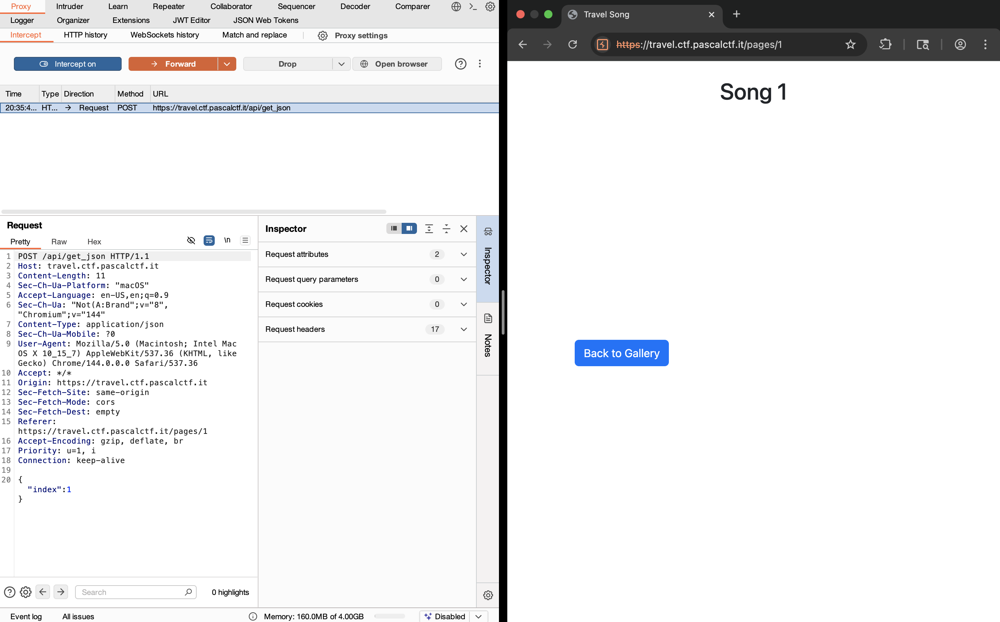
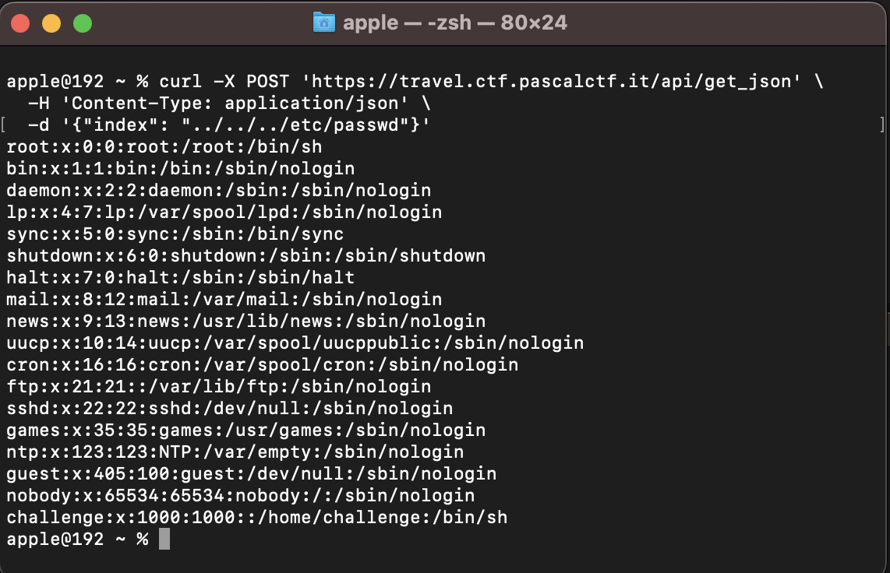
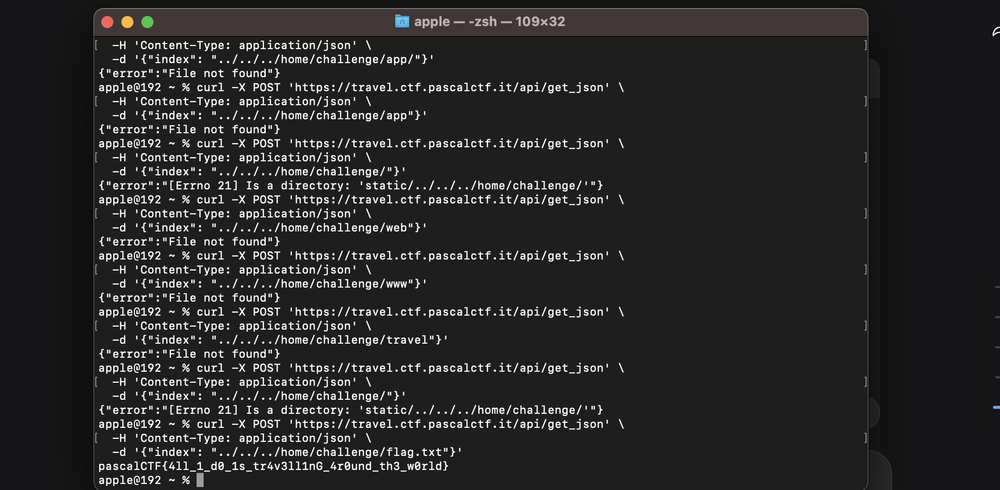

# Travel Playlist Challenge From PascalCTF 2026

## Challenge Overview

**Challenge Name:** travelplaylist 
**Vulnerability Type:** LFI / Bad param parsing
**Difficulty:** Medium  

## Step 1 : Analyzing :

Here is the vulner api endpoint parm

## Step 2 : I Switch from burp to curl, to tries fast:

and i make sure that is lfi :

## Step 3 : Search for Flag :

after many of requests and tries diffrent paths i found it :

## The End .