# 1337 BEGINNER LOCAL CTF   : ANSEMBLE 


**Category: Web**
**Difficulty: Medium**
**Tags: Recon, SSRF, Host Header Injection, SSTI**

## Overview

*This challenge requires a 2-stage exploitation chain. Players must first discover a hidden API endpoint, exploit a Blind SSRF via Host Header Injection to steal admin credentials, and finally bypass a strict Jinja2 SSTI blacklist/sandbox to achieve Remote Code Execution (RCE) and read the flag*

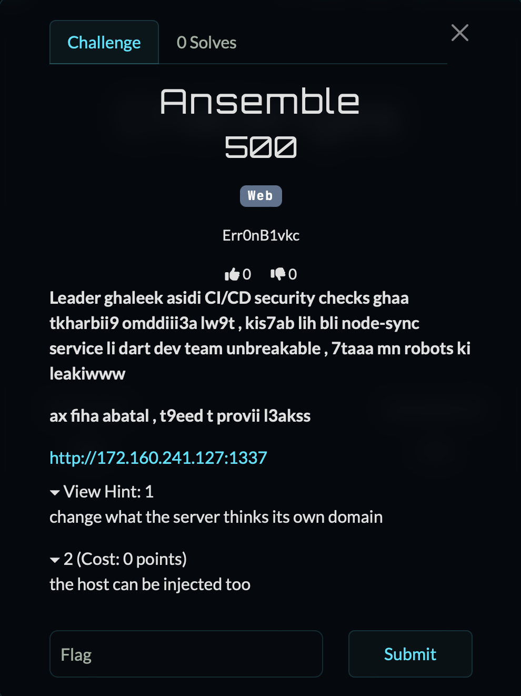

### Step 1: Reconnaissance & Enumeration

**Pay attention to the description: it highlights two crucial points—the supposed ‘unbreakable’ node-sync service, and the fact that even the robots are leaking. Both matter :**

Description :

*Leader ghaleek asidi CI/CD security checks ghaa tkharbii9 omddiii3a lw9t , kis7ab lih bli node-sync service li dart dev team unbreakable , 7taaa mn robots ki leakiwww* 

*ax fiha abatal , t9eed t provii l3akss*

At first, you’ll see the login page and probably try several attacks : SQL injection, timing attacks.

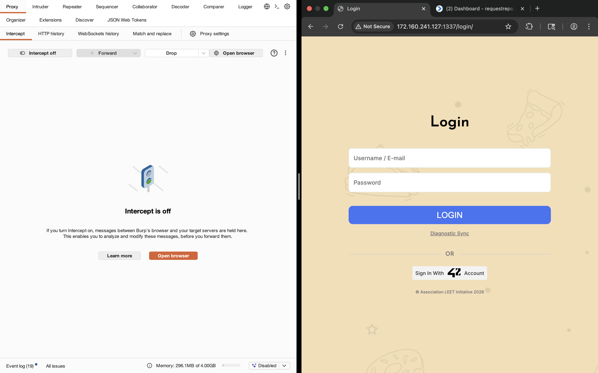

and then you give up and deciding to visit /robots.txt :

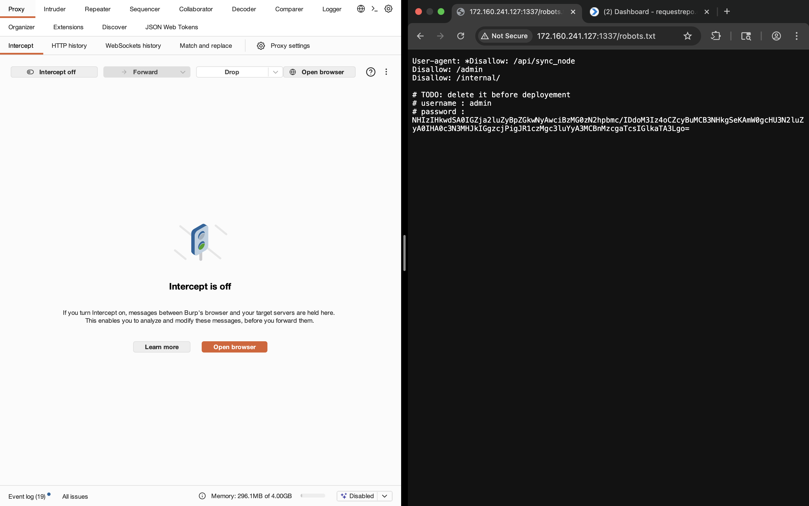


```
User-agent: *
Disallow: /api/sync_node
Disallow: /admin/
Disallow: /internal/

#TODO note that warning deleting credentials before deployement 
username : admin
password : Base64

```

Now we know the username is admin, and the password is encoded in Base64, Let’s decode it and see what it reveals

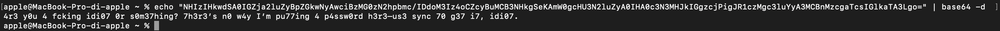

The decoding is mean that, if I want the password, I need to use /api/sync_node. *and this is what I was pointing to in the challenge description when the leader thought the node-sync service was unbreakable*


### Step 2 : Get the Password by using Sync API (Blind SSRF)

lets intercept the /api/sync_node :

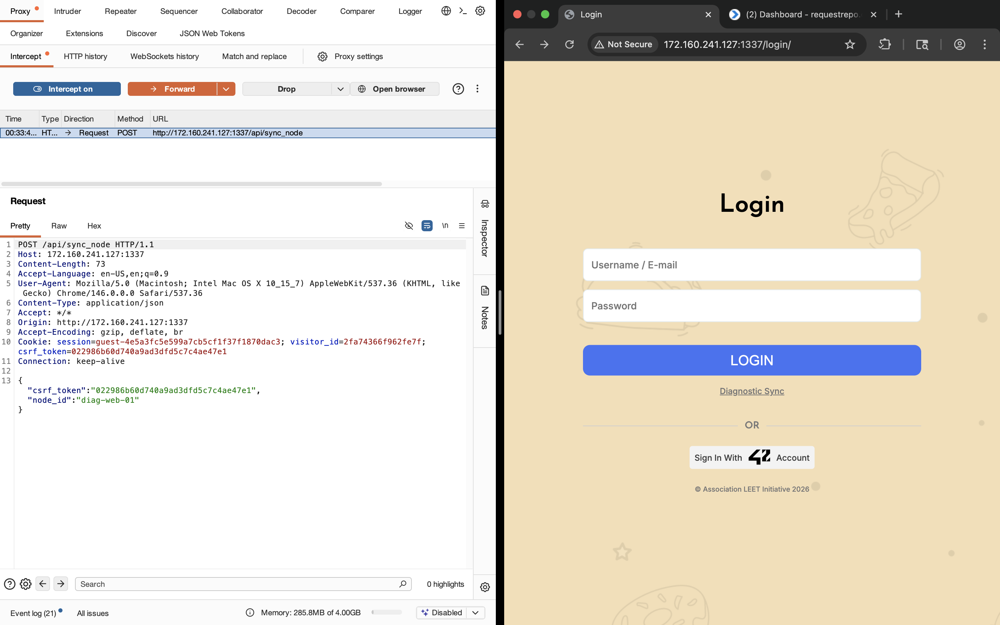

Sending a blank POST request to /api/sync gives us

```{"status": "error", "message": "Expected application/json."}```

#### After multiple attempts like SQLi in Node, mass assignments, and other common tests, you’ll try Host header manipulation such as Host: 127.0.0.1 :

You might mistakenly expect some error behavior , like : 

```Unrecognized host```

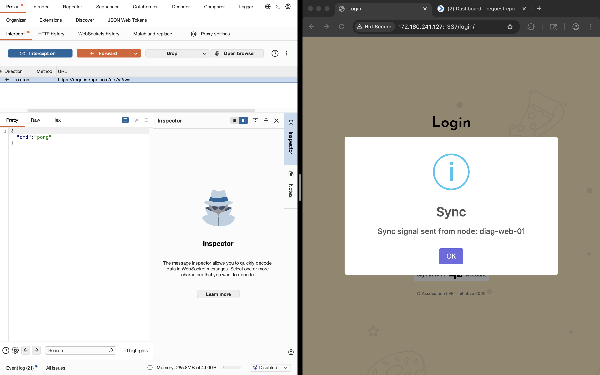

But the result is that the backend accepts what you wouldn’t expect it to accept, and the sync succeeds with a signal from node diag-web-01. Then you try changing the Host to your collaborator or webhook ID to see what happens : 


And then you see the surprise:

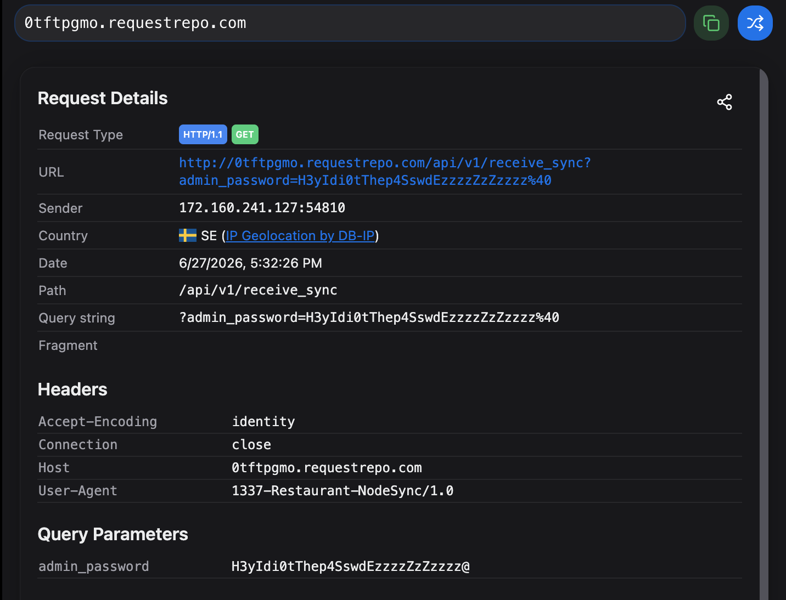

`The mention of ‘sync’ pushes you toward thinking in terms of request sender/receiver behavior. This leads you to experiment with Host header manipulation on /api/sync_node, assuming the backend might trust the Host value provided by the client. If the Host header is used in backend logic, this can turn into a Host header injection issue and potentially lead to SSRF-like behavior where the request is redirected toward an attacker-controlled or unintended destination instead of the developer-intended one.`

**Now u have both the username and password, let’s see what comes next**

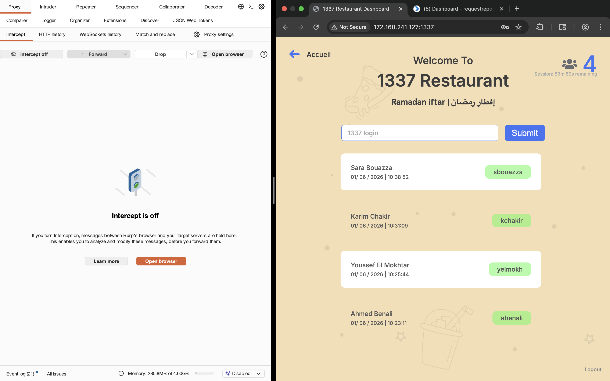

I tried to design something similar to a restaurant meal tagging system, and I even used 42 APIs to keep the player feeling like they’re hacking an ansamble and getting revenge on the whole school because of the bad meals we’ve been getting these days

By entering The Hacker ‘asebban’ in the login field, you get:


Let’s get back to the challenge. After multiple attempts and some thinking, you notice that whatever you enter is reflected, even if it’s incorrect login, This leads you to try xss, and then ss.. , yeah ssti + the response tells you Server is Python :

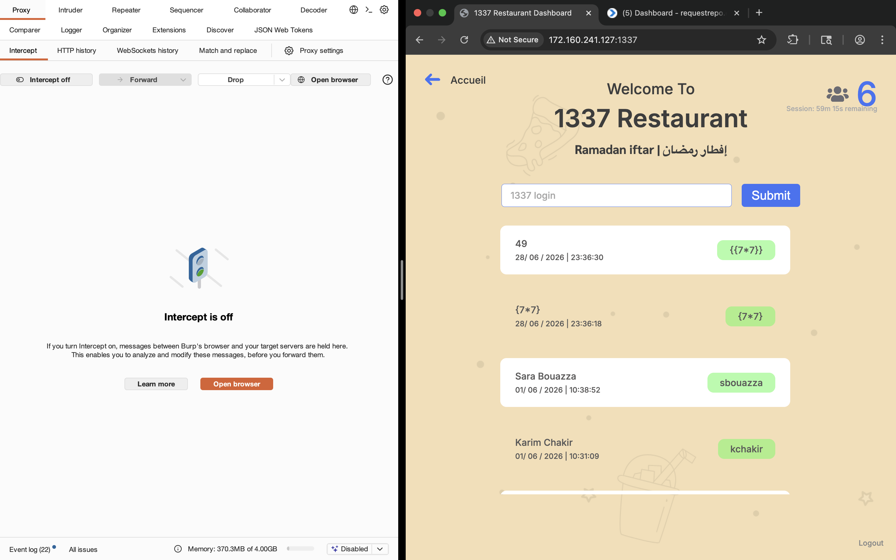

yeah is jinja2 ssti.

The first step in exploitation is usually enumerating preloaded objects available in the template context. In many environments, you may discover objects such as cycler, which are unintentionally exposed by the application, at first glance, this object does not look dangerous,However, in SSTI contexts, any accessible object can become an entry point into Python’s internal object graph


*During exploitation, you may observe that common Python introspection and execution primitives are blocked via a blacklist filter:*
```
BLACKLIST = [
    '__mro__',
    '__subclasses__',
    'subprocess',
    'system',
    'eval',
    'exec',
    'import',
]
```

**Expoitation chain**

```
cycler (exposed object)
   ↓
cycler.`__init__`(function reference)
   ↓
cycler.`__init__.__globals__`(global namespace access)
   ↓
retrieve "os" module from globals
   ↓
os.popen("ls /") (system command execution)
   ↓
.read() (capture output)
```


```{{ cycler.__init__.__globals__.os.popen('ls /').read() }}```

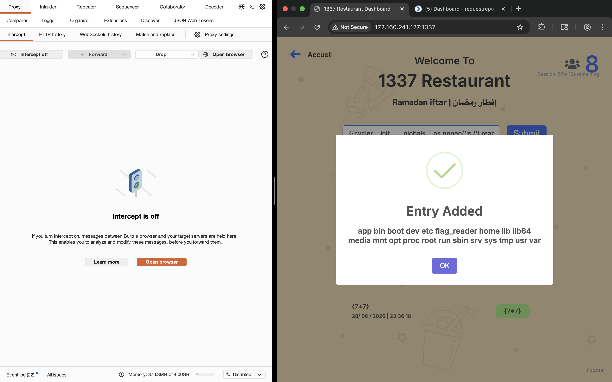

```{{ cycler.__init__.__globals__.os.popen('/flag_reader').read() }}```

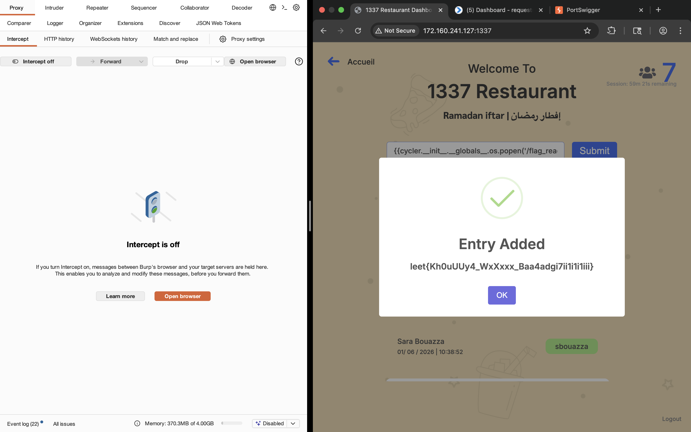

###### Thank youu ,for reading my bShit

Different examples of Host header injection, You can try similar techniques in upcoming challenges or targets:

https://medium.com/@deepanshudev369/interesting-story-of-an-account-takeover-vulnerability-140a45a058a3
https://medium.com/@salmank3/1-250-worth-of-host-header-injection-96563a2ac7e8
