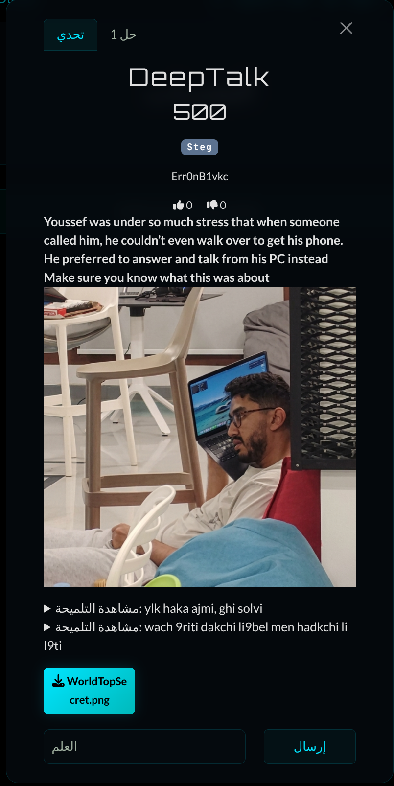
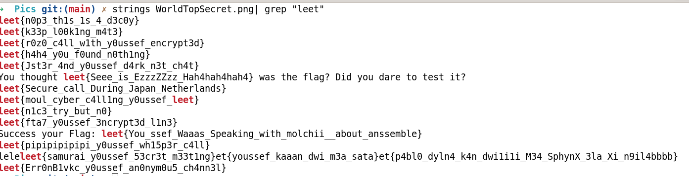
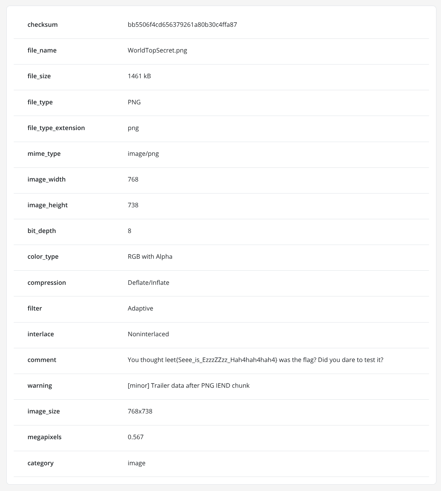
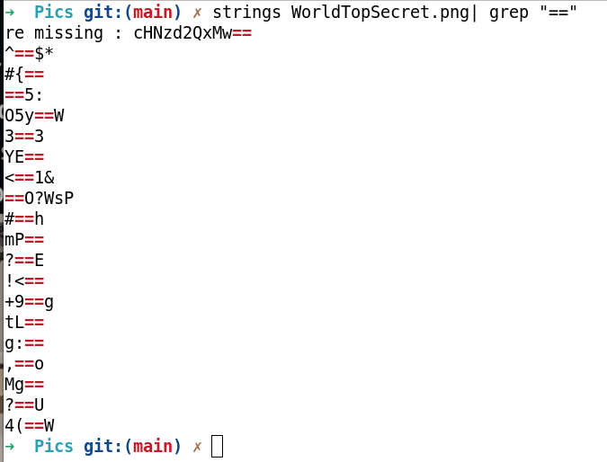
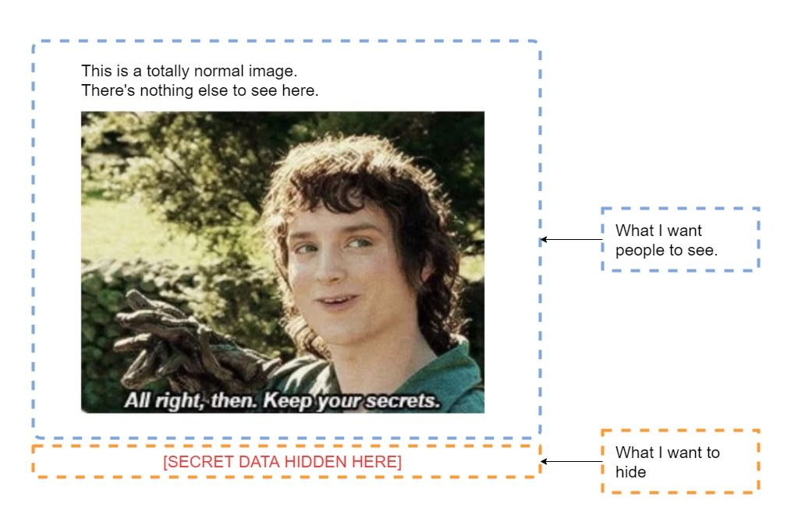
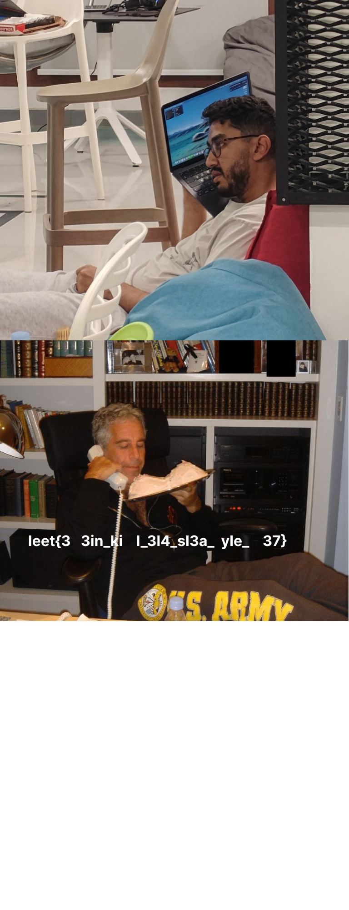
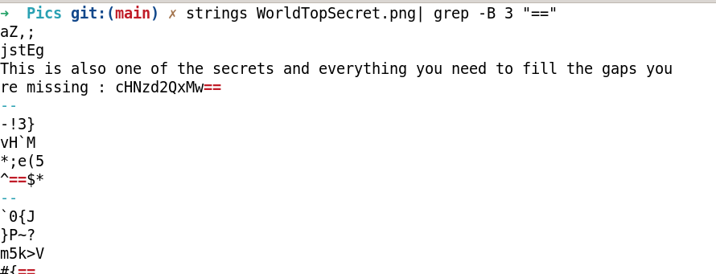
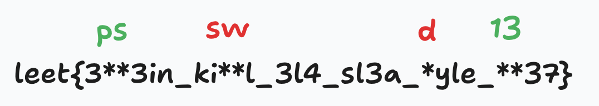

# 1337 BEGINNER LOCAL CTF   : DEEPTALK 


**Category: Steg**
**Difficulty: Easy**

## Overview
The challenge consisted of an image where you had to determine the exact location of the hidden flag. It contained a large number of fake flags, which made it intentionally misleading. That was the interesting part of the challenge—tricking solvers (and even agents using automated reasoning) into following false leads and going in the wrong direction.



When encountering a steganography image challenge, the first instinct is often to run tools like:

```strings image.png | grep "leet"```

However, in this case, the fake flags only added confusion and sent us down misleading paths



We then considered checking metadata:



After multiple failed submissions and incorrect flag guesses, we moved on to deeper analysis using binwalk. This revealed an embedded file: secret.zip 

We extracted it, only to find that it was password-protected

At this point, we returned to the original image for a closer look:

``` strings image.png | grep "==" ```



`cHNzd2QxMw==` 
     ↓
  psswd13

Using the recovered password, we unlocked secret.zip. However, even inside, the flag.txt content turned out to be misleading or incorrect.

but what if 



The Real Solution:

Revisiting the image structure revealed the actual trick: the height metadata was intentionally manipulated as a steganographic payload

This meant the hidden data was not in the visible content or archive alone, but in how the image itself was constructed.


```solve.py 

import struct
import zlib

def solve_stego(target_file, output_file):
    with open(target_file, "rb") as f:
        data = bytearray(f.read())

    max_guessed_height = 2000 
    
    data[20:24] = struct.pack('>I', max_guessed_height)

    crc_data = data[12:29]
    new_crc = zlib.crc32(crc_data) & 0xffffffff
    
    data[29:33] = struct.pack('>I', new_crc)

    with open(output_file, "wb") as f:
        f.write(data)
        
    print(f"[+] Exploit complete, Image height forced to {max_guessed_height}")
    print(f"[+] Open {output_file} to read the flag!")

solve_stego("WorldTopSecret.png", "Secret.png")
```

After fixing the image structure, previously invisible or “gapped” content became meaningful.



A final revisit of the binary strings confirmed the missing piece:

```strings WorldTopSecret.png | grep -B 3 "=="```



We realized the Base64 string served a dual purpose: it acted as the ZIP password and also as part of the hidden reconstruction logic filling the missing gaps



final flag is:

```leet{3ps3in_kiswl_3l4_sl3a_dyle_1337}```
