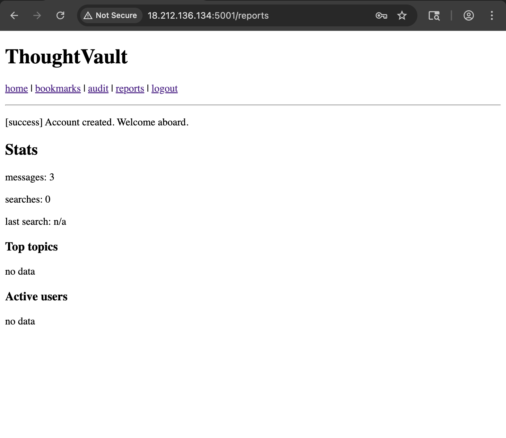
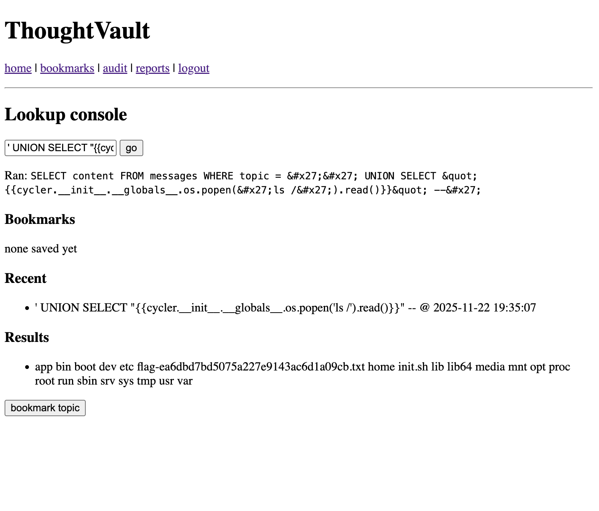
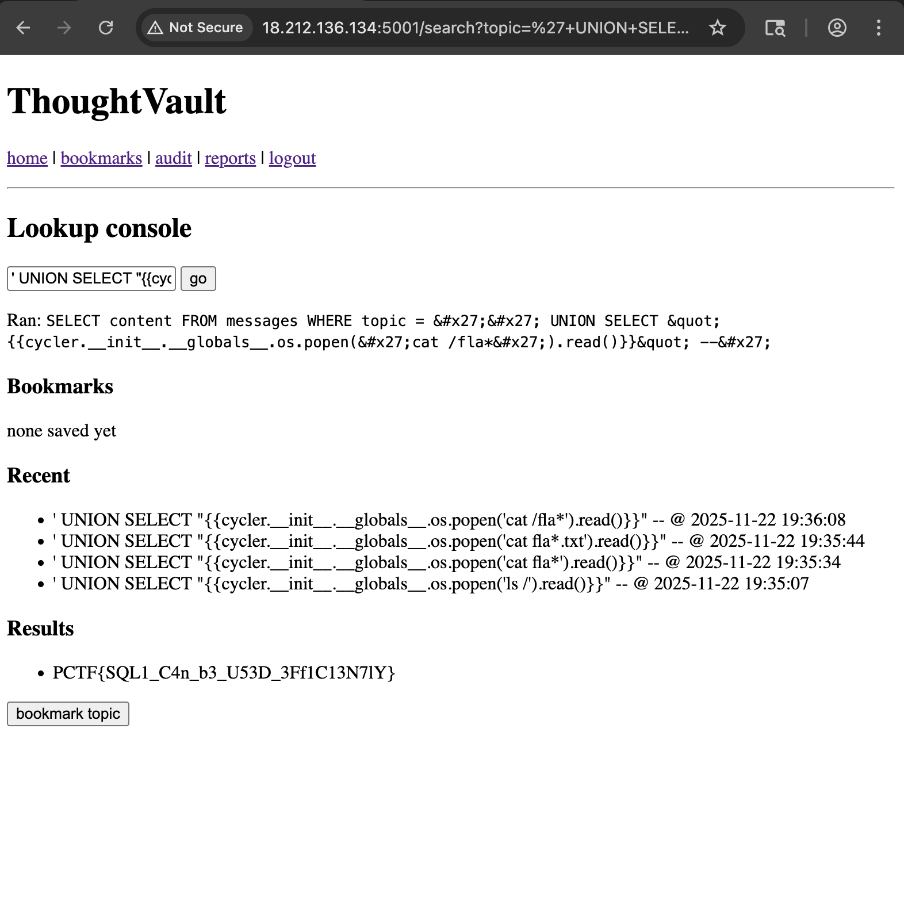

# Trust Vault (Web) From PCTF 2025

## Challenge Goal
Leak the **server-side flag** stored on disk or in environment variables by chaining an **SQL Injection** vulnerability with a **Jinja2 Server-Side Template Injection (SSTI)**.

---

## Initial Analysis

The challenge description strongly hints at:
- A vulnerable **SQL query**
- A **legacy Jinja rendering** issue

### After navigating to the provided application, we are presented with options to **register** or **log in**. Upon successful authentication, a welcome page is displayed with multiple links.



### Source Code Review

#### While reviewing the page source, an interesting **commented endpoint** was     discovered:


### This endpoint appears to allow users to **lookup messages**, making it a strong candidate for further testing.


## SQL Injection Discovery

### Accessing the `/search` endpoint reveals a crucial detail:  
### The application **prints the raw SQL query output directly to the page**.

## This confirms:
### - The presence of an **SQL Injection vulnerability**
### - User-controlled data is **reflected in the response**, which is essential for SSTI exploitation

## Confirming SSTI (Jinja2)

## Since the output is rendered via Jinja2, we can test for SSTI by injecting a Jinja expression through SQL injection.

### Proof of Concept Payload

```sql
' UNION SELECT '{{ 7*7 }}' --
```

## Result was 49 .

## Now we sure that is ssti using sqli .

```
' UNION SELECT "{{ cycler.__init__.__globals__.os.popen('ls /').read() }}" --
```




## Reading Flag file :

```
' UNION SELECT "{{ cycler.__init__.__globals__.os.popen('cat /fla*').read() }}" --
```



## The End .