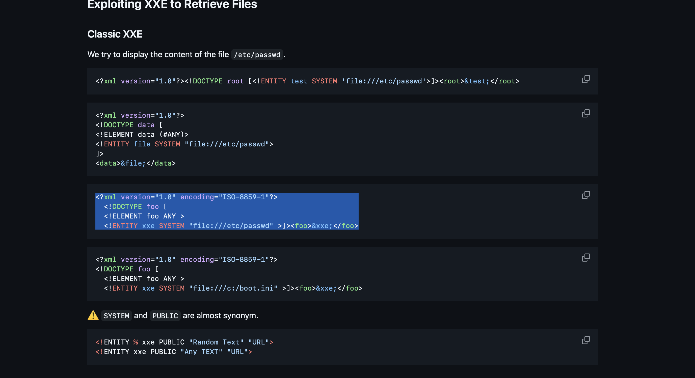
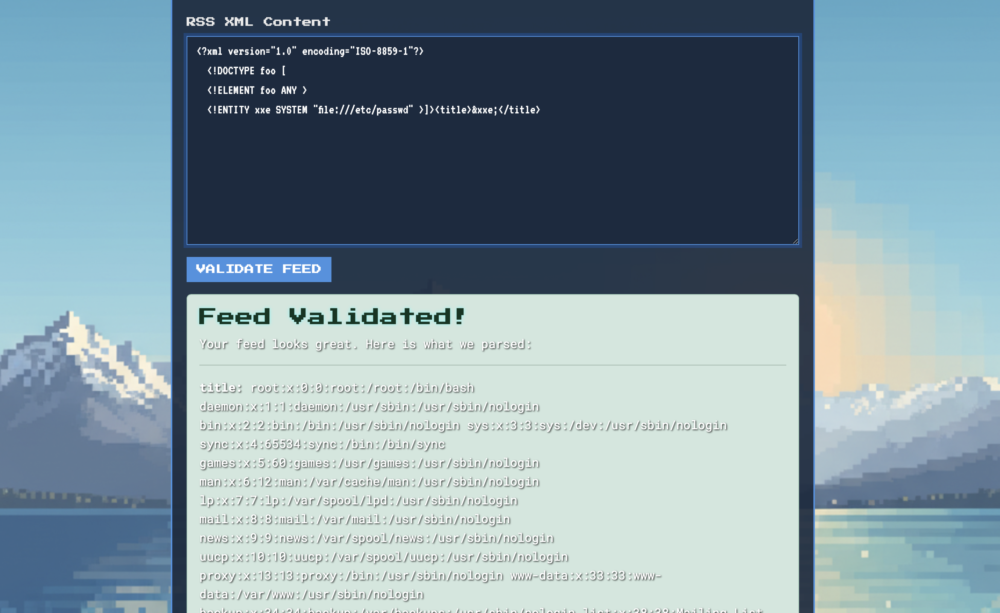
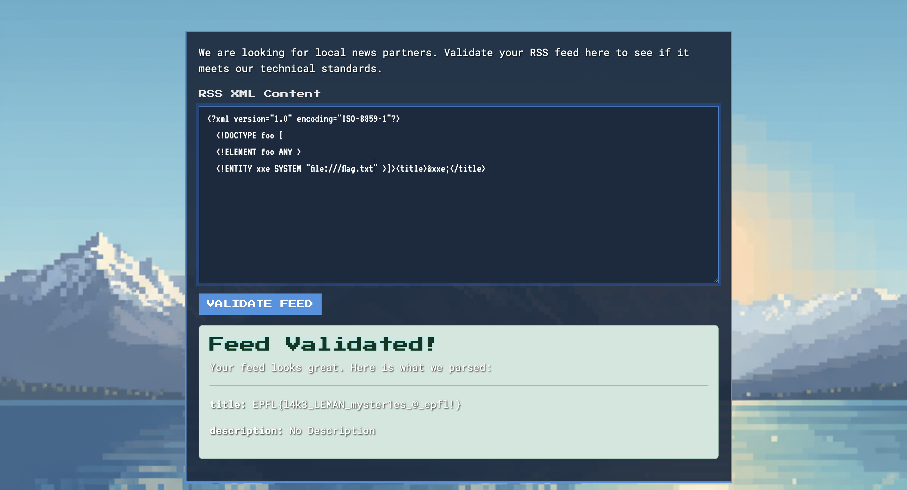

# XmlValidator - XXE Vulnerability Writeup from EPFL Ctf

**Challenge Type**: Web Security / XXE (XML External Entity Injection)  
**Difficulty**: Medium  

## Sorry for This undetailed Writeup.

## Step 1 : Get payload of xxe from payloadforallthings



## Step 2 : Edit Payload by changing element from foo to title :

and i try to get

```
file:///etc/passwd 
```

and this is result :


## Step3 : Now Get Flag :



## The End .